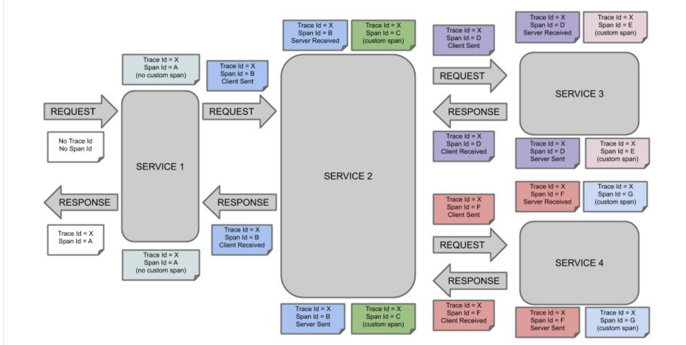
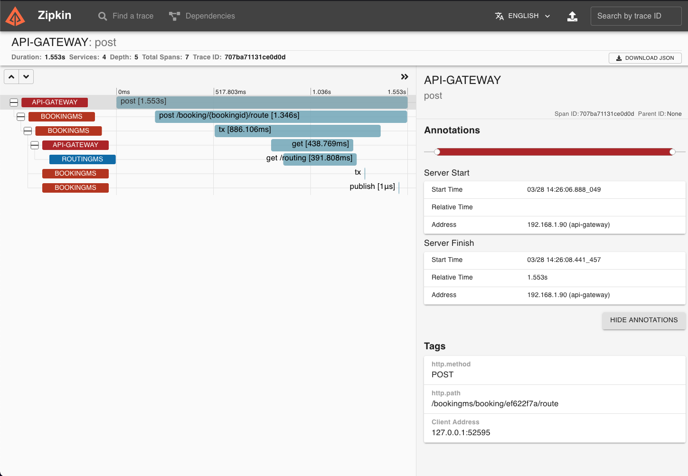

# Distribute Tracing/log

When we work with microservice by default any microservice store each log files. So we could have a requisition passing in multiple microservices, but we are not able to trace the flow between the microservices.


- Logs reflect a process's rhythm, its activity.
- Logging requires intrusive statements be added to the code, but the resulting logfiles themselves are one of the most decouple tools out there. There are entire ecosystems, tools, languages, and big data platforms that have developed entirely around usefully mining data from logs.

### You undertake two decisions when logging:

- log output
    - when do you what the output to appear? In a file? On the console? In a SyslogD service?
- log Levels
    - what granularity of output do you want? Do you want every little hiccup to be printed out, or just the things that may threaten the world?


## Spring Cloud Sleuth

Spring Cloud Sleuth provides Spring Boot auto-configuration for distributed tracing.

Spring Cloud Sleuth provides API for distributed tracing solution for [Spring Cloud](https://cloud.spring.io/). It integrates with [OpenZipkin Brave](https://github.com/openzipkin/brave)

Spring Cloud Sleuth is able to trace your requests and messages so that you can correlate that communication to corresponding log entries. You can also export the tracing information to an external system to visualize latency. Spring Cloud Sleuth supports [OpenZipkin](https://zipkin.io/) compatible systems directly.

**Features:**

- `Sleuth` configures everything you need to get started. This includes where trace data (spans) are reported to, how many traces to keep (sampling), if remote fields (baggage) are sent, and which libraries are traced.

- Specifically, Spring Cloud Sleuth:

  - Adds trace and span ids to the **Slf4J MDC**, so you can extract all the logs from a given trace or span in a log aggregator.

  - Instruments common ingress and egress points from Spring applications (servlet filter, rest template, scheduled actions, message channels, feign client).

  - If `spring-cloud-sleuth-zipkin` is available then the app will generate and report Zipkin-compatible traces via HTTP. By default, it sends them to a Zipkin collector service on localhost (port 9411). Configure the location of the service using spring.zipkin.baseUrl.


🚀 Necessary Dependency:

```xml
<dependency>
  <groupId>org.springframework.cloud</groupId>
  <artifactId>spring-cloud-starter-sleuth</artifactId>
</dependency>
```

👆 As long as Spring Cloud Sleuth is on the classpath any Spring Boot application will generate trace data:


Run this app and then hit the home page. You will see traceId and spanId populated in the logs. If this app calls out to another one (e.g. with RestTemplate) it will send the trace data in headers and if the receiver is another Sleuth app you will see the trace continue there.

- Instead of logging the request in the handler explicitly, you could set `logging.level.org.springframework.web.servlet.DispatcherServlet=DEBUG`

- Sleuth defaults to a rate limited sampler. That means that it will sample up to 1000 transactions per second.

- Set `spring.application.name=bar` (for instance) to see the service name as well as the trace and span ids.


## Terminology

- **Span**: 
  - The basic unit of work. For example, sending an RPC is a new span, as is sending a response to an RPC. Spans also have other data, such as descriptions, timestamped events, key-value annotations (tags), the ID of the span that caused them, and process IDs (normally IP addresses).
  - Spans can be started and stopped, and they keep track of their timing information. Once you create a span, you must stop it at some point in the future.

- **Trace**:
  - A set of spans forming a tree-like structure. For example, if you run a distributed big-data store, a trace might be formed by a PUT request.

- **Annotation/Event**: 
  - Used to record the existence of an event in time.
  - Conceptually in a typical RPC scenario we mark these events to highlight what kind of an action took place (it doesn’t mean that physically such an event will be set on a span).

    - cs: Client Sent. The client has made a request. This annotation indicates the start of the span.

    - sr: Server Received: The server side got the request and started processing it. Subtracting the cs timestamp from this timestamp reveals the network latency.

    - ss: Server Sent. Annotated upon completion of request processing (when the response got sent back to the client). Subtracting the sr timestamp from this timestamp reveals the time needed by the server side to process the request.

    - cr: Client Received. Signifies the end of the span. The client has successfully received the response from the server side. Subtracting the cs timestamp from this timestamp reveals the whole time needed by the client to receive the response from the serve

The following image shows how **Span** and **Trace** look in a system.



📚 [Official documentation](https://docs.spring.io/spring-cloud-sleuth/docs/current/reference/html/getting-started.html#getting-started-terminology)


> INFO [routingms,,] 36291 --- [3)-192.168.1.74] o.s.web.servlet.DispatcherServlet        : Completed initialization in 3 ms

```shell
curl -L -i -m 500 -H'Authorization: GOAT' -H'X-SYS: x1'  -X POST 'localhost:9090/bookingms/booking/ef622f7a/route
```

```shell
DEBUG [bookingms,223d69674c7f0fea,5b6b0d0702387430] 36284 --- [nio-8081-exec-1] o.s.web.servlet.DispatcherServlet        : POST "/booking/ef622f7a/route", parameters={}

INFO [bookingms,223d69674c7f0fea,5b6b0d0702387430] 36284 --- [nio-8081-exec-1] i.g.j.c.b.i.rest.CargoRoutingController  : [GOAT - x1] Cargo Routing Id <RouteCargoResource(bookingId=ef622f7a)>

DEBUG [bookingms,223d69674c7f0fea,5b6b0d0702387430] 36284 --- [nio-8081-exec-1] o.s.web.servlet.DispatcherServlet        : Completed 200 OK
```

```shell
 DEBUG [routingms,223d69674c7f0fea,3d33319c40aec234] 36288 --- [nio-8082-exec-1] o.s.web.servlet.DispatcherServlet        : GET "/routing?origin=ABC&destination=DEF&deadline=2022-04-01T21%3A23%3A43.598697Z", parameters={masked}

INFO [routingms,223d69674c7f0fea,3d33319c40aec234] 36288 --- [nio-8082-exec-1] i.g.j.c.r.i.rest.CargoRoutingController  : [GOAT - x1] Find Optimal Route origin <ABC>, destination <DEF>, deadline <2022-04-01T21:23:43.598697Z>

DEBUG [routingms,223d69674c7f0fea,3d33319c40aec234] 36288 --- [nio-8082-exec-1] o.s.web.servlet.DispatcherServlet        : Completed 200 OK
```

👆 You can notice that the logging format has been updated with the following information `[routingms,223d69674c7f0fea,3d33319c40aec234]`. This entry corresponds to `[application name,trace id, span id]`. The application name got read from the SPRING_APPLICATION_NAME environment variable.

---

## Integrate Spring Cloud Sleuth with Zipkin Server

- [Zipkin](https://zipkin.io/)

Zipkin is a distributed tracing system. It helps gather timing data needed to troubleshoot latency problems in service architectures. Features include both the collection and lookup of this data.

If you have a trace ID in a log file, you can jump directly to it. Otherwise, you can query based on attributes such as service, operation name, tags and duration. Some interesting data will be summarized for you, such as the percentage of time spent in a service, and whether or not operations failed.

There are other similar alternative, for example, Microprofile open trace specification server is the:
- [jaegertracing](https://www.jaegertracing.io/)
  

### How to install, Zipkin Server

1. Start the services
```
docker-compose up rabbitmq postgres zipkin -d
```
2. Add the necessary dependency to the projects:
```xml
<dependency>
  <groupId>org.springframework.cloud</groupId>
  <artifactId>spring-cloud-sleuth-zipkin</artifactId>
</dependency>
```

3. Add the zipkin configuration in application.yaml file, with the zipkin server.

```yaml
spring:
  zipkin:
    base-url: "http://localhost:9411/"
```

4. sleuth in the api-gateway needs an extra configuration

```yaml
spring:
  sleuth:
  reactor:
    instrumentation-type: decorate_on_each
```

### Testing

1. See all instances in service discovery:

- http://localhost:8761/
or 
- `curl http://localhost:8761/eureka/apps`

2. Perform a request:

```shell
curl -L -i -m 500 -H'Authorization: GOAT' -H'X-SYS: x1' -X POST 'localhost:9090/bookingms/booking/ef622f7a/route'
```

3. Consult zipkin server:
```
http://localhost:9411/
```



---

## Centralized Log with PAPERTRAILAPP
