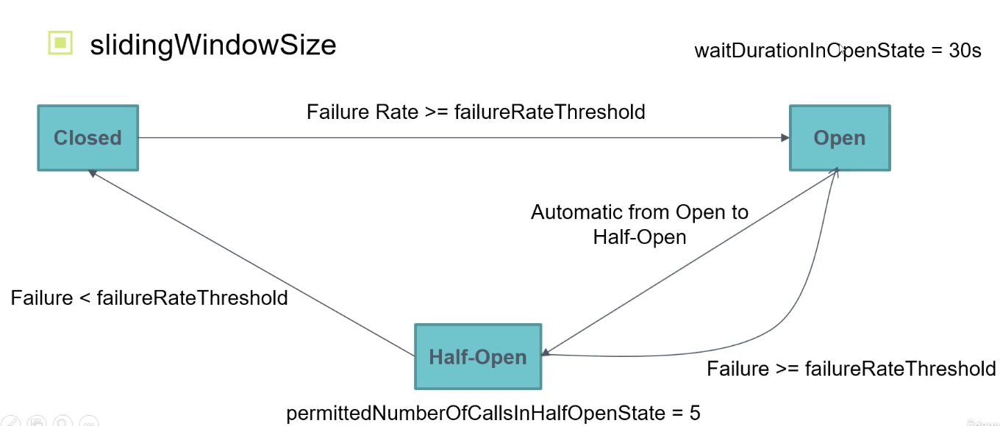

# 7 - Fault Tolerance

[Booking-ms] ===> [Routing-ms]

- we can have multiple problems in the communication between this two microservices:

1. Routing-ms is down
2. Routing-ms is having high failure rate

> who to deal with this kind of failures?

- In this real would, our system can have hundreds or thousands of microservice, if one microservice is having high failure rate, it could cascade the failures to other microservices with depend on him.
- We need to minimise the impact of fails in one microservice in the rest of the system. Those technics are Fault Tolerance design patterns.


## Circuit Breaker

- States
    - Closed: All calls allowed
    - Half Open: Few Calls allowed
    - Open: No calls allowed

### properties:

- `slidingWindowSize`: numeric value, how many calls we want to consider to make the decision, of switching the state from Closed to Open. For example, **last 100 calls**

- `failureRateThreshold`: how must percentage fails we want to tolerate. this means that the circuit break will change to open when [ Failure-rate > failureRateThreshold ].

- `waitDurationInOpenState`: How much time we want to stay in Open state. for example 30s. It  is important to keep in mind that we can't switch from the open to the closed state directly, we must pass always for the half-open state.

- `automatic from Open to half open`: boolean property. if true when waitDurationInOpenState expires the circuit breaker will switch to Half-open.

- `permittedNumberOfCallsInHalfOpenState`: How many calls we allow to be performed in Half-open state. for example 5. 
  - If the [failure rate > failureRateThreshold] then the circuit will switch again to the open state. 
  - Otherwise, if the [failure rate < failureRateThreshold], then the circuit will switch again to the Closed state.  




## How to:

1. Dependencies
```
io.github.resilience4j:resilience4j-spring-boot2:1.70 [or last]
org.springframework.boot:spring-boot-starter-aop
org.springframework.boot:spring-boot-starter-actuator
```

2. Configuration
```
resilience4j:
  circuitbreaker:
    instances:
      anyCircuitBreakerName:
        sliding-window-size: 10 # last 10 calls
        failure-rate-threshold: 50 # 50%
        wait-duration-in-open-state: 30000 # 30s, the value must be in mills
        automatic-transition-from-open-to-half-open-enabled: true
        permitted-number-of-calls-in-half-open-state: 5

        allowHealthIndicatorToFail: true
        registerHealthIndicator: true

management.health.circuitbreaker.enabled = true
management.endpoints.web.exposure.include = health
management.endpoint.health.show-details = always
## open: down, closed: up, half-open: unknown
```

3. apply the CircuitBracker annotation:

```java
class MyService {
    
  @CircuitBracker(name="anyCircuitBreakerName", fallbackMethod="findBestMatchFallbackMethod")
  public Book findBestMatch(String q) {
      // ...
  }
  
  // WE MAY NEED TO MOVE THIS TO A DIFFERENT CLASS CAUSE THE AOP
  // in case of any error occurrences, must have the same signature and one extra parameter is allowed Throwable, that will be the exception, if we want to log.
  public Book findBestMatchFallbackMethod(String q, Throwable e) {
      // return any dummy result
  }

}
```


---

```
resilience4j:
  circuitbreaker:
    instances:
      fetchRoute:
        sliding-window-size: 10 # last 10 calls
        failure-rate-threshold: 50 # 50%
        wait-duration-in-open-state: 30000 # 30s, the value must be in mills
        automatic-transition-from-open-to-half-open-enabled: true
        permitted-number-of-calls-in-half-open-state: 5

        allowHealthIndicatorToFail: true
        registerHealthIndicator: true

# management.health.circuitbreaker.enabled = true
# management.endpoints.web.exposure.include = health
# management.endpoint.health.show-details = always
## open: down, closed: up, half-open: unknown
```


### Change Status Logging

```java
package io.github.jlmc.cargo.bookingms.infrastructure.resilience4j;

import io.github.resilience4j.circuitbreaker.CircuitBreaker;
import io.github.resilience4j.core.registry.EntryAddedEvent;
import io.github.resilience4j.core.registry.EntryRemovedEvent;
import io.github.resilience4j.core.registry.EntryReplacedEvent;
import io.github.resilience4j.core.registry.RegistryEventConsumer;
import org.slf4j.Logger;
import org.slf4j.LoggerFactory;
import org.springframework.context.annotation.Bean;
import org.springframework.context.annotation.Configuration;

@Configuration
public class CircuitBreakerLogConfig {

    @Bean
    public RegistryEventConsumer<CircuitBreaker> circuitBreakerLogger() {
        return new RegistryEventConsumer<CircuitBreaker>() {

            private static final Logger LOGGER = LoggerFactory.getLogger("CircuitBreakerLogger");

            @Override
            public void onEntryAddedEvent(EntryAddedEvent<CircuitBreaker> entryAddedEvent) {
                CircuitBreaker circuitBreaker = entryAddedEvent.getAddedEntry();
                circuitBreaker.getEventPublisher()
                              .onStateTransition(event -> {
                                  LOGGER.info(event.toString());
                              });
            }

            @Override
            public void onEntryRemovedEvent(EntryRemovedEvent<CircuitBreaker> entryRemoveEvent) {
            }

            @Override
            public void onEntryReplacedEvent(EntryReplacedEvent<CircuitBreaker> entryReplacedEvent) {
            }
        };
    }

}

```

## Actuator
- `curl localhost:9090/bookingms/actuator/health | jq .` 

## References

https://github.com/resilience4j/resilience4j/issues/568
https://www.youtube.com/watch?v=LnOK32zvxVg
