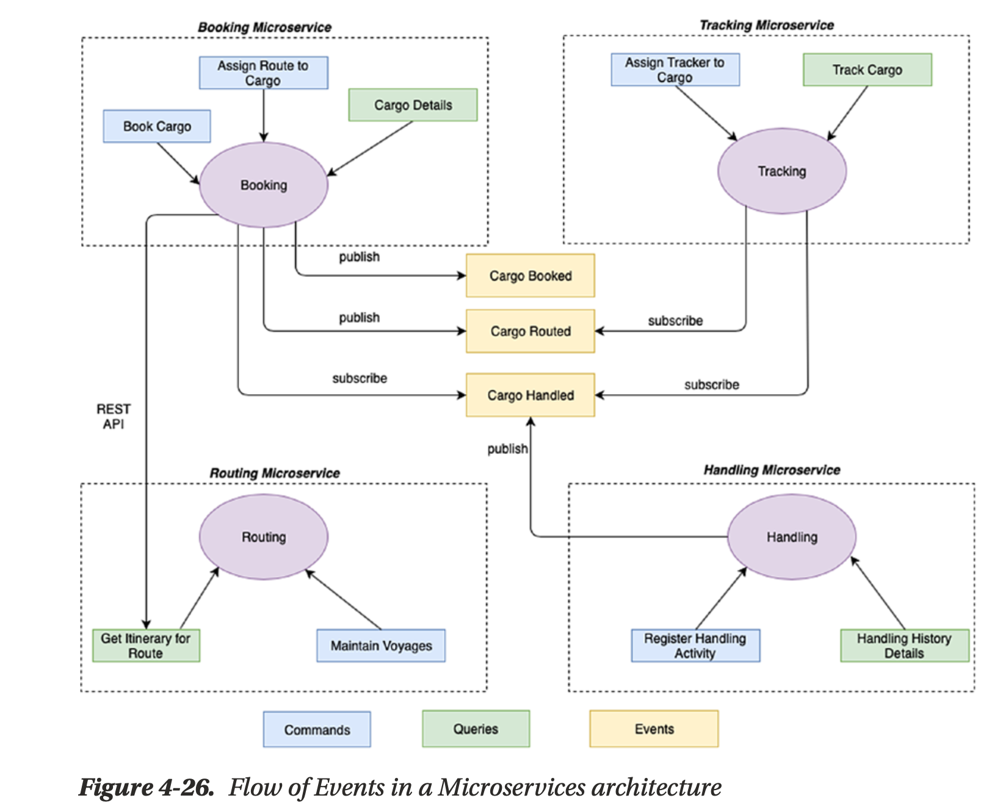

# Spring Cloud

## Use case - Cargo tracker



> Demonstrate well established architectural patterns/blueprints for enterprise development with Jakarta EE using pretty close to a real world application.  
> 
> Demonstrate a concrete implementation of DDD concepts.

- We are going to use the well-known cargo tracker case study project.
- Of course, we will not use all the features, that wouldn't be of much interest in our examples, because we're trying to play with a different theme.  

- 🚀 I selected only three use cases that will serve as a basis for all the examples:

#### Use Case 1: Booking a new cargo

```shell
curl -L -m 500 -X POST 'localhost:8081/booking' \
-H 'Content-Type: application/json' \
--data-raw '{
  "bookingAmount": 12,
  "originLocation": "ABC",
  "destLocation": "DEF",
  "destArrivalDeadline": "2022-04-01T21:23:43.598697Z"
}' | jq .
```

#### Use Case 2: Route an existing cargo

```shell
curl -L -m 500 -X POST 'localhost:8081/booking/c5016ff0/route' | jq .
```

#### Use Case 3: Get Cargo details

```shell
curl -L -m 500 -X GET 'localhost:8081/booking/c5016ff0' | jq .
```


## Agenda

- [Configuration Server](1-config-server/PRESENTATION.md)
